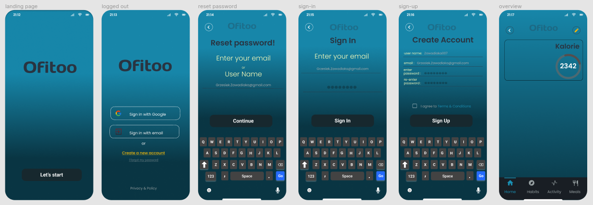
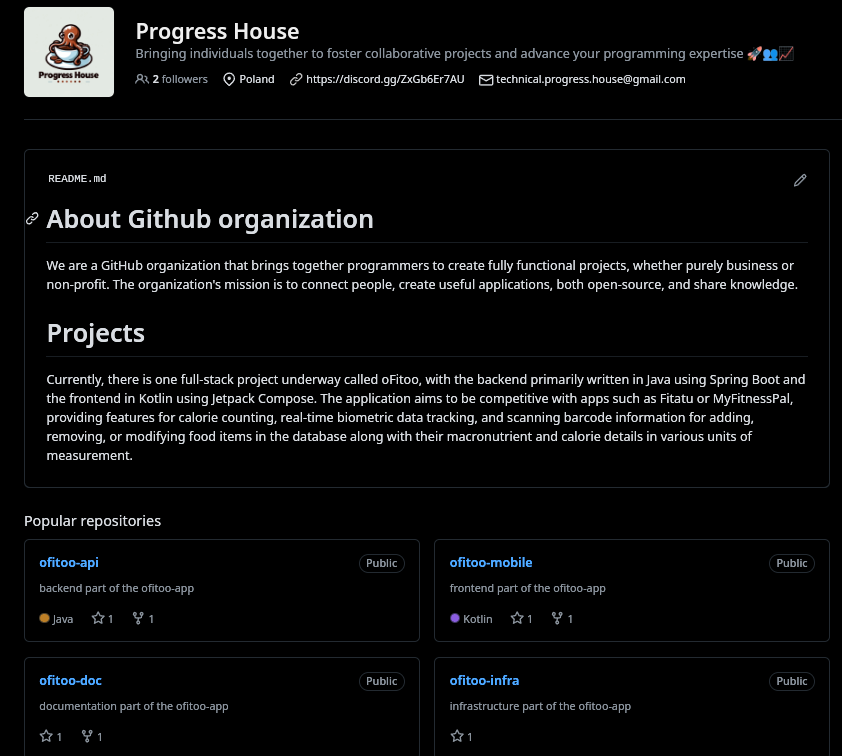
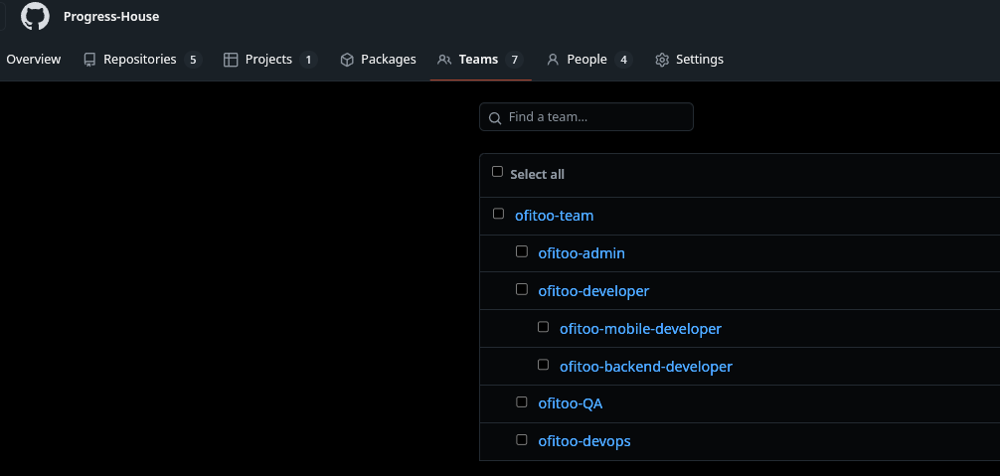
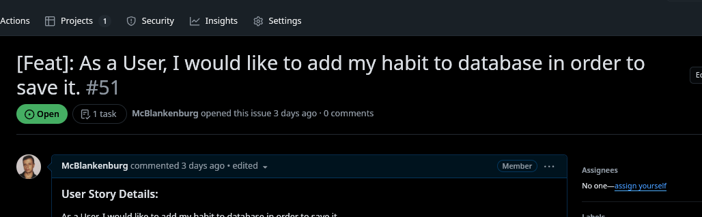
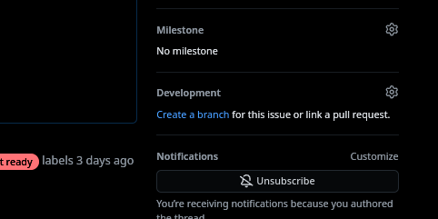
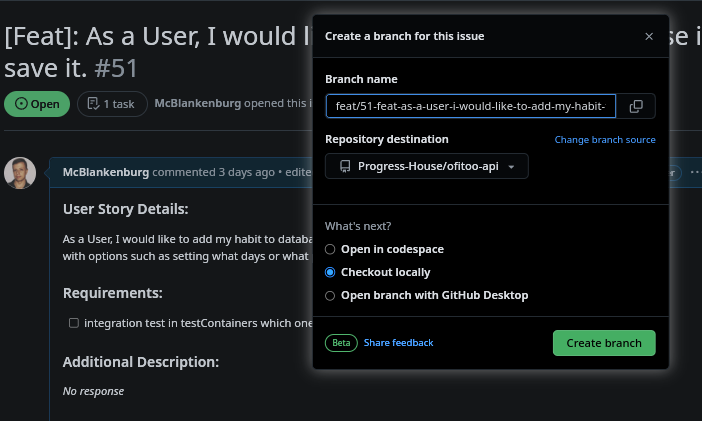

# onboarding - po polsku


Witamy na pokładzie, o to rzeczy, które musisz wiedzieć przed dołączeniem do zespołu pracującego nad aplikacją Ofitoo.

## Opis aplikacji i jego docelowych funkcjonalności
Ofitoo to aplikacja mobilna, która pomoże ci
zadbać o zdrowie, monitorować twoje odżywianie oraz osiągać cele związane z dietą i aktywnością fizyczną.  
Takie jak utrata wagi czy zwiększenie masy mięsniowej.  
Aplikacja ma łączyć w sobie najlepsze cechy popularnych rozwiązań z takich aplikacji jak MyFitnessPal i Fitatu,  
jednocześnie oferując prostote i możliwość odłączenia zbędnych dla nas modułów zabierając je z naszego pola widzenia.  

## Wsparcie Społecznościowe i Finansowanie Open Source
"Aplikacja, będąca w pełni funkcjonalna, ma być oferowana za darmo.  
Koszty związane z utrzymaniem infrastruktury informatycznej będą pokrywane z dobrowolnych wpłat,
takich jak 'postaw nam kawę', oraz z dochodów z reklam oraz sponsoringu.  
Wszystkie prace programistyczne są realizowane na zasadzie dobrowolnego wolontariatu, 
z chęcią przyczynienia się do rozwoju projektu open-source."  

## UX/UI Design Aplikacji Mobilnej

<details>
  <summary>[Kliknij by rozwinąć]</summary>

  

  wizualizacja (chatGPT 4.0)

  
</details>

## Architektura API
<details>
  <summary>[Kliknij by rozwinąć]</summary>


</details>


## Organizacja Github Progress-House
Projekt jest pierwszym projektem organizacji na Github - Progress House, ale mamy nadzieje ze nie ostatnim :)   
https://github.com/Progress-House  

<details>
  <summary>[Kliknij by rozwinąć]</summary>


</details>

## Discord
W celu dołączenia do organizacji, i związanego z nią projektu ofitoo kliknij na link do naszego discord'a który
powinien być podczepiony pod organizacje, i napisz do nas wiadomość na kanale "rekrutacja" lub bezpośrednio do któregoś z leadów projektu.
<details>
  <summary>[Kliknij by rozwinąć]</summary>


</details>

## Uprawnienia do repozytoriów
Jeżeli zaakceptujemy twoją aplikacje do projektu, w zalezności od swojej roli zostaniesz przydzielony do odpowiedniego teamu na github.  
Kazdy github'owy team ma nadane odpowiednie uprawnienia READ/WRITE do odpowiednich repozytoriów.  
np jako java dev bedziesz miał uprawnienia [write] do ofitoo-api, a jako android dev [write] do ofitoo-mobile.
<details>
  <summary>[Kliknij by rozwinąć]</summary>


</details>

Teraz gdy masz już wymagane uprawnienia stwórz wygodnym dla ciebie miejscu folder ofitoo,  
a w nim otwórz bash / powershell i zaciągnij wszystkie repozytoria.

https://github.com/orgs/Progress-House/repositories?q=ofitoo

Wystarczy wszystko na raz wkleic w terminal.
<details>
  <summary>[Kliknij by rozwinąć]</summary>


</details>

```
mkdir ofitoo
cd ofitoo
git clone https://github.com/Progress-House/ofitoo-doc
git clone https://github.com/Progress-House/ofitoo-api
git clone https://github.com/Progress-House/ofitoo-mobile
git clone https://github.com/Progress-House/ofitoo-infra
```

<details>
  <summary>[Kliknij by rozwinąć]</summary>


</details>
W celu zbudowania każdego z poszczególnych projektów udaj się do pliku README.md w każdym z tych projektów.  
przykładowo:  

https://github.com/Progress-House/ofitoo-api/blob/develop/README.md  
https://github.com/Progress-House/ofitoo-mobile/blob/develop/README.md  

<details>
  <summary>[Kliknij by rozwinąć]</summary>


</details>


## Podejmowanie zadań - na przykładzie ofitoo-api
Jeśli jesteśmy już pełnoprawnymi członkami zespołu,  
wchodzimy w "issue" danego repozytorium np.   
https://github.com/Progress-House/ofitoo-api/issues  
Issue to lista "zagadnień" w danym repozytorium.  
Każdy "issue" powinien być dobrze opisany, być podpięty do projects: ofitoo-kanban  
gdzie wypełniony jest jego "Status", "Piority" oraz "Difficulty" przez liderów projektu.  
A także posiadać odpowiednie "labels" dzięki którym jesteśmy w stanie sortować issues i na pierwszy rzut oka dowiedzieć się z czym się ono wiąże.

"labels" mogą różnić się w zależności od repozytorium, przykładowo label "documentation issue" nie istnieje w ofitoo-doc gdyż
całe te repozytorium jest jedną wielką dokumentacją.

### Podczas wybierania zadań zwracaj uwage "labels" jak:
- **blocked by issue** - zadanie może być zblokowane przez inne zadanie
- **devops issue** - możliwe ze będziemy potrzebować dodatkowych uprawnień admin'a
- **issue not ready** - zadanie może nie spełniać definition of ready", więcej w linku poniżej.
- https://github.com/Progress-House/ofitoo-doc/blob/official/shared-good-practices/issues/definition-of-ready.md

<details>
  <summary>[Kliknij by rozwinąć]</summary>


</details>

Jeżeli chcemy się podjąć któregoś z zadań, wchodzimy do odpowiadającego nam zadania i wciskamy "assign yourself"

<details>
  <summary>[Kliknij by rozwinąć]</summary>


</details>

następnie wciskamy "create branch" 
<details>
  <summary>[Kliknij by rozwinąć]</summary>


</details>

i do wygenerowanej automatycznie nazwy brancha dopisujemy odpowiedni przedrostek zgodnie z naszymi standardami zawartymi tutaj:  
https://github.com/Progress-House/ofitoo-doc/blob/official/shared-good-practices/git-flow/branch-and-commits-convention.md
Prosimy o dokładne przestudiowanie powyzszej dokumentacji.

<details>
  <summary>[Kliknij by rozwinąć]</summary>


</details>

dopisanie feat/ do nazwy brancha gdyż issue zaczyna się od [Feat]: (czyli feature) zgodnie z branch-and-commits-convention  

<details>
  <summary>[Kliknij by rozwinąć]</summary>

  
i wciskamy Create branch
</details>

## Ofitoo-kanban
Możemy również przeglądać zadania wchodząc w Progress-House/Projects/ofitoo-kanban

mamy do wyboru kilka widoków

- **🌍 Full Kanban** - widok kanban bez podziału na repozytoria   
  https://github.com/orgs/Progress-House/projects/9/views/11  
- **🌱 Backend / API** - widok na kanban ofitoo-api  
  https://github.com/orgs/Progress-House/projects/9/views/8    
- **📚 Documentation** - widok na kanban ofitoo-doc  
  https://github.com/orgs/Progress-House/projects/9/views/9    
- **📱 Mobile** - widok na kanban ofitoo-mobile  
  https://github.com/orgs/Progress-House/projects/9/views/10    
- **🏗️ Infrastructure** - widok na kanban ofitoo-infra  
  https://github.com/orgs/Progress-House/projects/9/views/12    
- **👤 Assignee to me** - widok na kanban z uwzględnieniem tylko nas samych  
  https://github.com/orgs/Progress-House/projects/9/views/6    
- **📋 List per Person** - lista grupująca zadania per osoba  
  https://github.com/orgs/Progress-House/projects/9/views/13    
- **🎈 Backlog** - lista dostępnych zadań z backlog'u  
  https://github.com/orgs/Progress-House/projects/9/views/14    

## Issue Flow: 
- kiedy podejmujecie zadanie lub tworzycie brancha przez github, powinno być   
przesuwane z kolumny `"Backlog"` do `"In Progress"`  


- kiedy wystawicie pull requesta zadanie powinno być   
przesuwane z `"In Progress"` do `"In Review" ` 


- kiedy pull-request zostanie zmergowany zadanie powinno być
przesuwane z `"In Review"` do `"Done"`,
a issue powinien być zamykany.


- kiedy zadanie jest zablokowane przez inne zadanie lub nieoczekiwane problemy 
  trafia do kolumny `"Blocked / Suspended"`


## Git-flow
Naszym głównym branchem developerskim jest "develop" jest to gałąż od której odbijamy inne branche.  
develop jest chroniony przez CI/CD które sprawdza za każdą próbą dociągnięcia kodu do develop'a czy się on buduje.  

za każdym razem kiedy branch typu feature, bugfix itd jest mergowany do develop'a odbywa to się za pomocą strategii
git merge-squash tak by po wielu waszych commitach został tylko jeden z nazwą danego brancha.

jednakże kiedy chcemy uaktualnić kod na branchu preprod lub prod dociągając go z develop'a to robimy to strategią rebase
tak by nie pozostawał dodatkowy commit związany z tą operacją.

<details>
  <summary>[Kliknij by rozwinąć]</summary>

  
</details>


# Na wszystkie pytania związane z projektem pytaj nas na kanale Discord. Witaj w zespole :)

